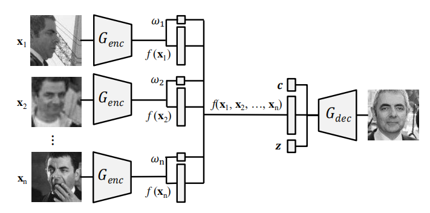
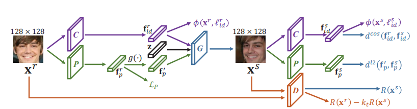
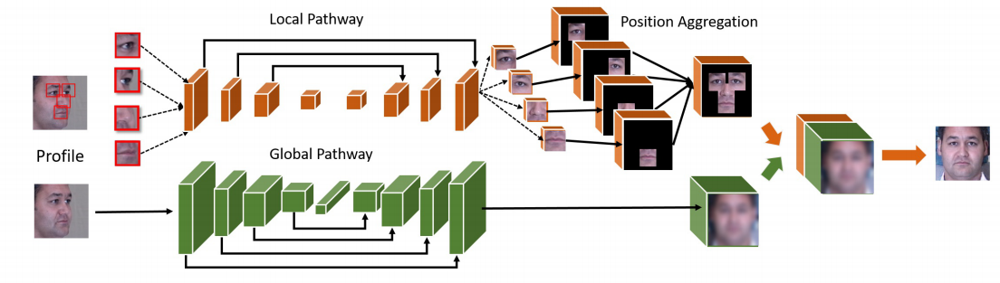
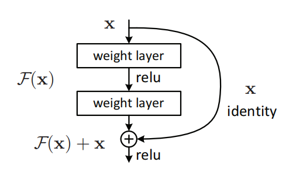
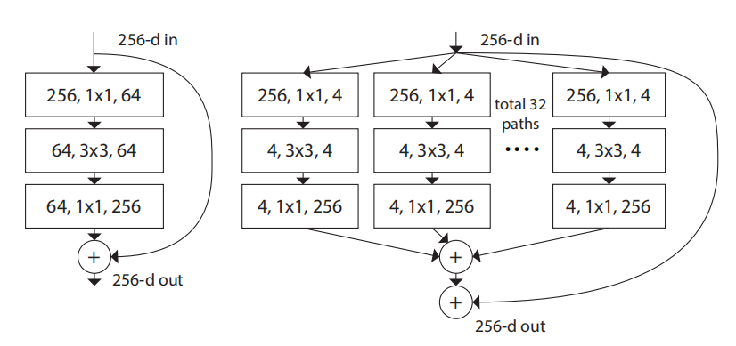
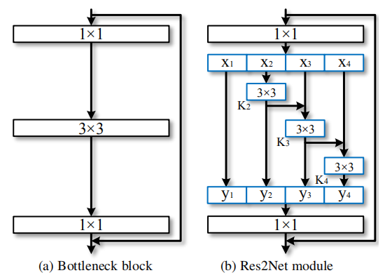

## 基于TP GAN + Res2Net的多姿态人脸识别

#### 生成模型

DR-GAN(CVPR 2017)

[Disentangled Representation Learning GAN for Pose-Invariant Face Recognition](../literature/Disentangled Representation Learning GAN for Pose-Invariant Face Recognition.pdf)

[DR-GAN 在 CFP数据集上的实现](https://github.com/kayamin/DR-GAN)

FaceID-GAN(CVPR 2018)

[FaceID-GAN: Learning a Symmetry Three-Player GAN for Identity-Preserving Face Synthesis](../literature/FaceID-GAN: Learning a Symmetry Three-Player GAN for Identity-Preserving Face Synthesis.pdf)

TP-GAN(ICCV 2018)

[Beyond Face Rotation: Global and Local Perception GAN for Photorealistic and Identity Preserving Frontal View Synthesis](../literature/Beyond Face Rotation: Global and Local Perception GAN for Photorealistic and Identity Preserving Frontal View Synthesis.pdf)

#### 判别模型

ResNet(CVPR 2016)

[Deep Residual Learning for Image Recognition](../literature/Deep Residual Learning for Image Recognition.pdf)

ResNeXt(CVPR 2017)

[Aggregated Residual Transformations for Deep Neural Networks](../literature/Aggregated Residual Transformations for Deep Neural Networks.pdf)

Res2Net(2019.11)

[Res2Net: A New Multi-scale Backbone Architecture](../literature/Res2Net: A New Multi-scale Backbone Architecture.pdf)

#### 参考文献：

[1] Rui Huang, Shu Zhang, Tianyu Li. Beyond Face Rotation: Global and Local Perception GAN for Photorealistic and Identity Preserving Frontal View Synthesis. arXiv preprint arXiv:1704.04086, 2017

[2] Shang-Hua Gao, Ming-Ming Cheng, Kai Zhao. Res2Net: A New Multi-scale Backbone Architecture. arXiv preprint arXiv:1904.01169v2, 2019

[GAN原理解析，公式推导与python实现 - CSDN](https://blog.csdn.net/qq_39422642/article/details/79004646)

[基于TP-GAN的侧脸人像恢复 - CSDN](https://blog.csdn.net/zhuimengshaonian66/article/details/83413646)

[ResNet介绍 - CSDN](https://blog.csdn.net/u013181595/article/details/80990930)

[一文简述ResNet及其多种变体 - 机器之心](https://mbd.baidu.com/newspage/data/landingshare?pageType=1&isBdboxFrom=1&context=%7B%22nid%22%3A%22news_9688944228228558526%22%7D)

[目标检测新突破！了解Res2Net深度多尺度目标检测架构](https://mp.weixin.qq.com/s?__biz=MzIxODM4MjA5MA==&mid=2247492127&idx=4&sn=3f0a147210a7cda8a5d326955ec915c9&chksm=97e9c87aa09e416cc19c164c6b3db2c99234c6a9ab86f1c4c6fa7f3f2197527cb55fbff9513a&mpshare=1&scene=1&srcid=12176cj61Wv4If5KRSFFmlls&sharer_sharetime=1576572914152&sharer_shareid=84848f604153d18786b882c837b05da7&exportkey=AxvPZDRbE%2B6n%2FKtCXDGXrU4%3D&pass_ticket=SxgxXcAY9XDPbROh1yfM9gGW4H9kX%2BJ%2B%2FPqm6E2x1D6Y5KVn2EDxWXvI6s8%2BvRsC#rd)

[CNN 的骨干网络 backbone - CSDN](https://blog.csdn.net/baishuo8/article/details/89926028)

[DR-GAN：Disentangled Representation Learning GAN for Pose-Invariant Face Recognition论文解读](https://blog.csdn.net/qq_34914551/article/details/87365119)

[论文阅读： FaceID-GAN: Learning a Symmetry Three-Player GAN for Identity-Preserving Face Synthesis](https://blog.csdn.net/tobale/article/details/80841361)

