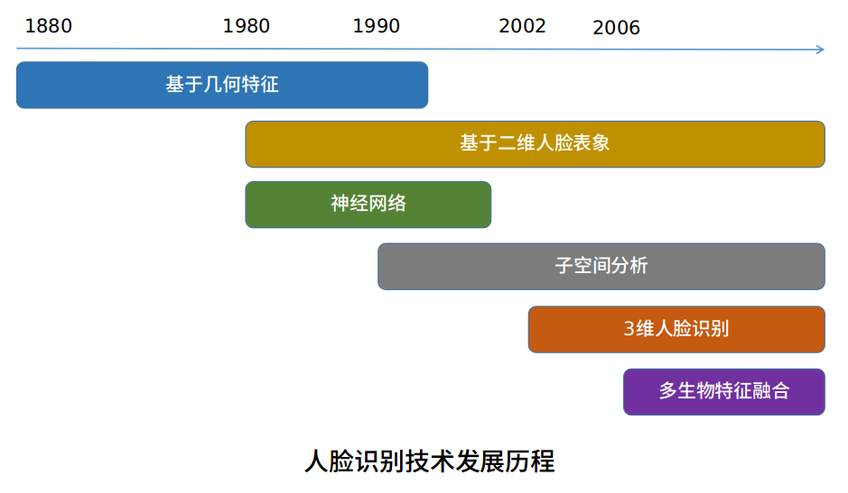
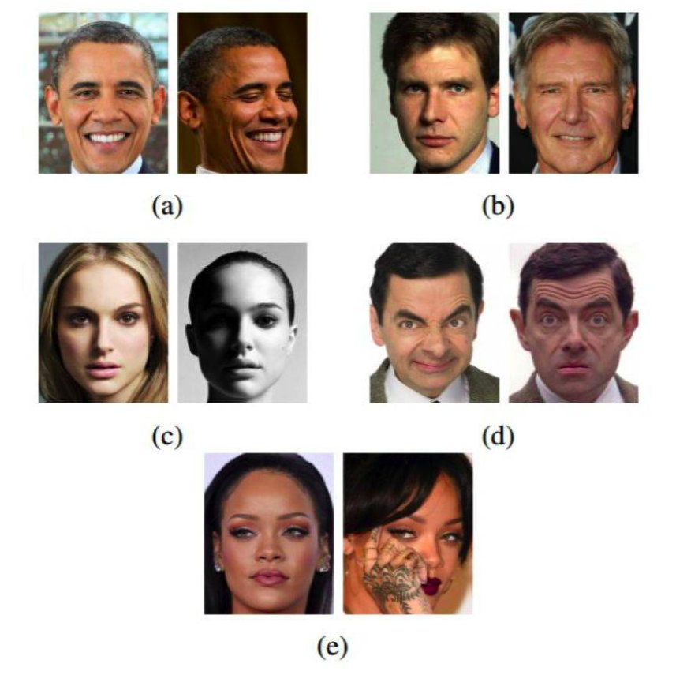

## 人脸识别研究背景

人脸识别问题可以描述为：给定某一场景下的静态图象或者动态序列，根据预先存储的人脸数据库识别或者认证场景中一个或者多个人的身份。

### 人脸识别研究历史

​		人脸识别研究最早可追溯到 1888 年 Galton发表于 Nature 上的论文，他利用一组数字代表不同的侧面人脸特征，并从心理学的角度分析人类自身的人脸识别能力． 1910 年，Galton提出利用人脸面部的关键点及关键点之间的距离构成表示人脸的特征向量，并利用该向量进行身份识别，这是基于几何特征人脸识别方法的雏形，但并不是真正的自动人脸识别( Automatic Face Ｒecognition，AFＲ) 。

​		最早的自动人脸识别研究起源于 20 世纪 60 年，代表性成果是 1965 年 Chan 等在 PanoramicＲesearch Incorporated 上发表的技术报告。 国内人脸识别研究起步较晚，1979 年《自动化学报》发表一篇“人工智能国外研究情况综述”，这是能检索的国内期刊第一次出现“人脸识别”的概念。 1992 年，洪子泉等发表于《自动化学报》的“用于图象识别的图象代数特征抽取”及郑坚平等发表于《计算机工程》的“标准正面人脸图像识别”，是国内人脸识别研究领域检索到最早的学术论文。

​		

​		上图描述了从原始特征的角度看到的人脸识别经历的几个主要的发展阶段，分别历经从几何特征到表象特征到纹理特征的发展过程。

​		早期的研究是基于高层特征的几何参数，包括面部器官的几何特性，如双眼间距、头宽、鼻高，和面部关键特征点的相对几何关系，如两眼角和鼻尖的距离比等，代表性的工作是 Bledsoe 于 1964 年构建的半自动人脸识别系统。

​		20 世纪 80 年代以后主流人脸识别的特征提取方法进入了基于二维人脸表象的阶段，并一直持续到深度学习出现之前。在基于表象特征的人脸识别发展阶段中，基于神经网络的方法也曾兴起过一阵，但是当时受限于软硬件的条件，只能采用浅层的线性神经网络，所以效果并不突出。

​		除了神经网络的方法，基于子空间分析的方法也在人脸识别的研究中逐渐占据了主流。子空间分析主要研究的是特征分析与分类算法，企图在提取到的人脸特征中，通过特征降维、变换等多种手段，提升特征的鉴别能力。从实际角度而言，后期基于传统机器学习算法的人脸识别通常会将基于表象特征和子空间分析的方法结合起来，共同提升人脸识别的性能。

​		传统算法的性能趋于饱和，研究者们开始从信息源的角度，将人脸识别从二维静止图象向三维人脸和视频人脸拓展。其中三维数据的表示格式主要有三维点集、曲面网格、深度图和 EGI (Extended Gaussian Image) 几种，匹配的方法大致可以分为空域直接匹配、局部特征匹配、整体特征匹配，此外还出现了将 2D 和 3D 融合的人脸识别算法。

​		随着视频监控技术在安全等领域的广泛应用，2000 年以后开始兴起了对视频中人脸识别的研究。相对静止图象而言，视频图象序列包含了更为丰富的表象信息，而视频中的时空信息比如身份的连续性，人脸姿态、表情变化的连续性，在整个图象区域空间上的连续性也可以用以提高识别的准确性。这就使得人脸识别的研究进入了一个利用多模态信息和多生物特征融合的新的发展阶段。

### 人脸识别研究现状

​		在过去的几十年中，人脸识别技术越来越多受到国内外研究者的关注． 尤其是20 世纪90 年代以来，人脸识别技术的研究和应用都取得巨大进步，涌现出一大批从事人脸识别研究的高校和科研院所，且每年都有大量的学术论文发表。与此同时，人脸识别技术逐渐走向产品化，不断有商业性人脸识别系统进入市场． 但受到人脸识别方法的限制，大部分人脸识别产品只能在用户配合的情况下使用，这大大限制人脸识别技术的应用范围和发展步伐。

​		目前，非配合、非受控环境下的人脸识别逐渐引起研究者的关注。受限于采集环境，获取的人脸图像经常存在多种姿态变化、光照变化、表情变化、遮挡干扰等，针对这些干扰因素，研究者也开展大量相关的研究。由于姿态变化给人脸识别研究带来巨大的挑战及其本身具有的重要意义，近年来，多姿态人脸识别渐成为人脸识别研究领域的一个重要方向。

​		

​		当被部署在无约束条件的环境中时，由于人脸图像在现实世界中的呈现具有高度的可变性（这类人脸图像通常被称为自然人脸（faces in-the-wild）），所以人脸识别也是最有挑战性的生物识别方法之一。人脸图像可变的地方包括头部姿势(a)、年龄(b)、光照条件(c)、人脸表情(d)、面部遮挡(e)。

### 人脸识别应用领域

​		相比于指纹或虹膜识别等传统上被认为更加稳健的生物识别方法，人们往往更偏爱人脸识别。让人脸识别比其它生物识别方法更受欢迎的一大不同之处是人脸识别本质上是非侵入性的。比如，指纹识别需要用户将手指按在传感器上，虹膜识别需要用户与相机靠得很近，语音识别则需要用户大声说话。相对而言，现代人脸识别系统仅需要用户处于相机的视野内（假设他们与相机的距离也合理）。这使得人脸识别成为了对用户最友好的生物识别方法。这也意味着人脸识别的潜在应用范围更广，因为它也可被部署在用户不期望与系统合作的环境中，比如监控系统中。人脸识别的其它常见应用还包括访问控制、欺诈检测、身份认证和社交媒体。

- 金融领域：人脸识别当前在金融领域的应用最为广泛，当前国内金融领域监管要求严格，金融相关产品都需要实名认证，并且具有较高的安全性要求，活体识别，银行卡ocr识别，身份证ocr识别，人证对比等在各大手机银行，金融app，保险app等都已经成为不可或缺的一个环节。
- 安保领域：目前大量的企业，住宅，社区，学校等安全管理越来越普及，人脸门禁系统已经成为非常普及的一种安保方式。
- 通行领域：很多城市的火车站已经安装了人脸识别通行设备，进行人证对比过检，有些城市的地铁站也可以通过人脸识别的方式进行地铁进出站通行。
- 泛娱乐领域：现在市场上火爆的美颜相机，网络直播，短视频等都是建立在人脸识别的基础上对人脸进行美颜和特效处理。
- 公安，司法领域：公安系统在追捕逃犯时也会利用人脸识别系统对逃犯进行定位，监狱系统目前也会对服刑人员通过人脸识别系统进行报警和安防。
- 自助服务设备：如银行的自动提款机，无人超市等。
- 考勤及会务：如工作考勤，会议出席人脸墙等。

#### 发展趋势

1. 基于大数据的大规模人脸搜索是人脸识别技术未来发展的重要方向。例如，在公安领域已经跨入大数据时代，一些传统技术瓶颈显现，因此，利用人脸识别技术将这些海量照片数据利用起来，提升整个公安信息化的管理水平，是未来人脸识别技术发展的重要方向。

2. 深度学习将人脸识别的准确度提升至肉眼级别，大大拓展了2D人脸识别的应用场景，并借助互联网金融爆发的东风，步入金融级应用并作为基础设施迅速普及。此外，随着互联网金融等业务身份认证的需求爆发，第三方认证服务平台将会出现，基于提供服务的平台型盈利模式发展空间巨大。

3. 随着三维测量技术的发展，基于3D的人脸识别算法能够弥补2D投影造成有效识别信息丢失的问题，对于人脸旋转、遮挡、极度相似的传统难点具有很好的解决方式，也逐渐成为人脸识别技术的另一重要发展路线，随着3D人脸库的完善以及设备成本的降低，3D技术将有很大发展空间。

4. 随着我国城市化进程的加速，社会稳定、城市安全等问题逐渐显现，而人脸识别技术是实现安全、安心城市的关键技术。因此，随着智慧城市的大规模建设，人脸识别技术的应用将是未来新趋势。

5. 安防行业的迅速发展，为人脸识别应用提供了可以发挥的舞台；另一方面，随着人脸识别技术的进一步发展，为安防行业开拓了新的市场。分析认为，智能视频分析将是大安防市场未来的方向之一，而人脸识别是其中非常重要的技术和应用。

6. 人脸识别技术由于其便利性、安全性，可在智能家居中用作门禁系统以及鉴权系统，因此智能家居与人脸识别技术的融合是未来发展的重点方向。智能家居中的人脸识别系统是结合嵌入式操作系统和嵌入式硬件平台建立的，加强了人脸识别技术与智能家居应用的结合度，具有概念新、实用性强等特点。

### 人脸识别常用方法

​		人脸识别技术基本上可以归结为三类，即：基于几何特征的方法、基于模板的方法和基于模型的方法。

- 基于几何特征的方法是最早、最传统的方法，通常需要和其他算法结合才能有比较好的效果。

  人脸关键点（特征点）的精确定位本身就是一个比较困难的问题，容易受到姿态和表情等变化的影响，从而导致特征很不稳定；直到现在，人脸特征点定位仍然是人脸算法最重要的一个研究方向。同时提取到的几何特征过于简单，丢失了大量的图象鉴别信息，降低了不同人之间的可分性。所以基于几何特征的算法鲁棒性很差，总体识别准确率不高，不可能构建有实际应用价值的人脸识别系统。

- 基于模板的方法可以分为基于相关匹配的方法、特征脸方法、线性判别分析方法、奇异值分解方法、神经网络方法、动态连接匹配方法等。

- 基于模型的方法则有基于隐马尔柯夫模型，主动形状模型和主动外观模型的方法等。

介绍几种在[LFW](./dataset.md)数据集上表现较好的方法：

#### 1. face ++ (99.50%)

文献：[Naive-Deep Face Recognition: Touching the Limit of LFW Benchmark or Not?](../literature/Naive-Deep Face Recognition: Touching the Limit of LFW Benchmark or Not?.pdf)

#### 2. DeepFace (97.35%)

文献：[DeepFace: Closing the Gap to Human-Level Performance in Face Verification](../literature/DeepFace: Closing the Gap to Human-Level Performance in Face Verification.pdf)

#### 3. FR + FCN (96.45%)

文献：[Recover Canonical-View Faces in the Tild with Deep Neural Networks](../literature/Recover Canonical-View Faces in the Tild with Deep Neural Networks.pdf)

#### 4. DeepID (97.45%)

文献：[DeepID3: Face Recognition with Very Deep Neural Networks](../literature/DeepID3: Face Recognition with Very Deep Neural Networks.pdf)

#### 5. FaceNet (99.63%)

文献：[FaceNet: A Unified Embedding for Face Recognition and Clusteri](../literature/FaceNet: A Unified Embedding for Face Recognition and Clusteri.pdf)

#### 6. Baidu (99.77%)

文献：[Targeting Ultimate Accuracy: Face Recognition via Deep Embedding](../literature/Targeting Ultimate Accuracy: Face Recognition via Deep Embedding.pdf)

#### 7. pose+shape+expression augmentation (98.07%)

文献：[Do We Really Need to Collect Millions of Faces for Effective Face Recognition?](../literature/Do We Really Need to Collect Millions of Faces for Effective Face Recognition?.pdf)

#### 8. CNN-3DMM estimation (92.35%)

文献：[Regressing Robust and Discriminative 3D Morphable Models with a very Deep Neural Network](../literature/Regressing Robust and Discriminative 3D Morphable Models with a very Deep Neural Network.pdf)

### 参考文献：

[1] 邹国锋, 付桂霞, 海涛, 等. 多姿态人脸识别综述. 模式识别与人工智能, 2015, 28(7): 613 - 625

[2] 杨赛, 赵春霞, 刘凡, 等.  一种基于多种特征融合的人脸识别算法. 计算机辅助设计与图形学学报, 2017, 29(9): 1667 - 1672

[3] 周凯汀, 郑力新. 基于改进ORB特征的多姿态人脸识别. 计算机辅助设计与图形学学报, 2015, 27(2): 287 - 294

[4] 景晨凯, 宋涛, 庄雷, 等. 基于深度卷积神经网络的人脸识别技术综述. 计算机软件与应用, 2018, 35(1): 223 - 231

[人脸识别主要算法原理 - CSDN](https://blog.csdn.net/liulina603/article/details/7925170)

[人脸识别常用方法 - 简书](https://www.jianshu.com/p/361fc79e45bd)

[一文看懂人脸识别技术发展脉络 - InfoQ](https://www.infoq.cn/article/CfW4lObDUR-Oiw5PUcru)

[人脸识别应用领域以及未来的行业发展趋势 - ITpub](http://blog.itpub.net/29829936/viewspace-2641737/)

[人脸识别技术全面总结：从传统方法到深度学习 - 机器之心](https://www.jiqizhixin.com/articles/2019-02-10-4)

[基于深度学习的人脸识别技术综述 - 知乎](https://zhuanlan.zhihu.com/p/24816781)

[使用深度卷积神经网络方法进行3D人脸重建 - 知乎](https://zhuanlan.zhihu.com/p/24316690)