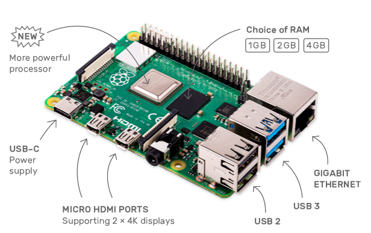
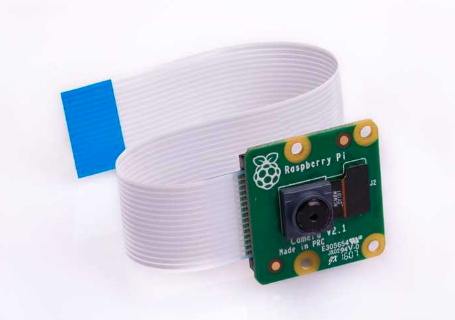
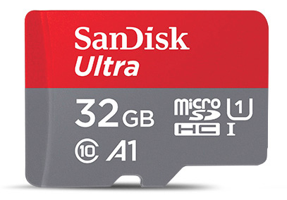
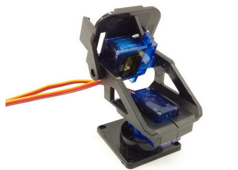

# 开发环境

## 一、硬件

### 1、 Raspberry Pi 4（树莓派4B）

- 1.5GHz四核64位ARM Cortex-A72 CPU
- 4GB的LPDDR4 SDRAM
- 全吞吐量千兆以太网
- 双频802.11ac无线网络
- 蓝牙5.0
- 两个USB 3.0和两个USB 2.0端口
- 支持双显示器，4K分辨率
- VideoCore VI图形，支持OpenGL ES 3.x
- HEVC视频的4Kp60硬件解码

### 2、 Raspberry Pi Camera rev 1.3（树莓派摄像头）

- 500万 像素
- OV5647 感光芯片
- 静态图片分辨率 2592 * 1944

### 3、 SanDisk microSDHC存储卡（存储操作系统）

- 32GB 容量
- 98MB/S 读取速度

### 4、舵机云台（可选）

## 二、软件

#### Raspbian Buster with desktop

#### python 3.7

#### OpenCV 4.1.0
