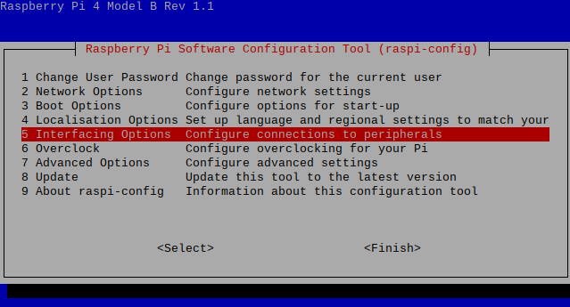
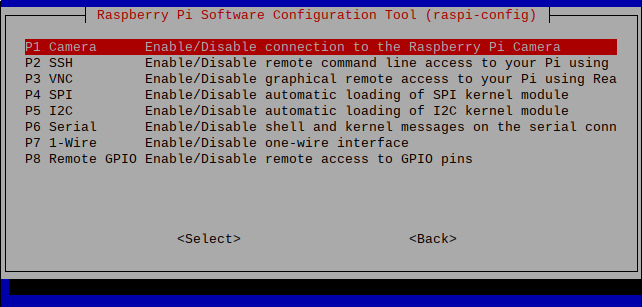
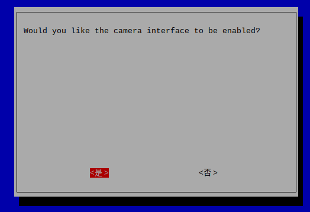
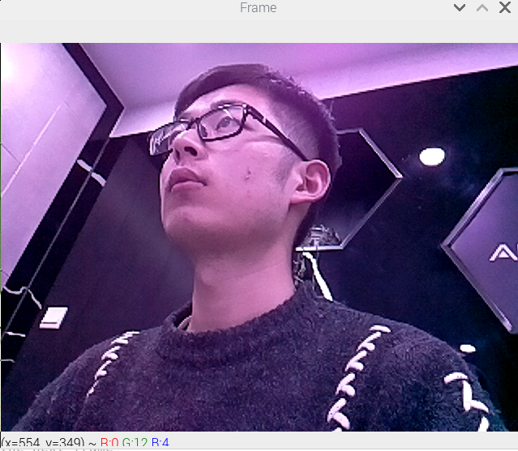

# 环境部署

## 一、安装操作系统

更新树莓派软件源，提升速度

```sh
# 编辑'/etc/apt/sources.list'文件
sudo vi /etc/apt/sources.list

# 用以下内容替换原文件内容
deb http://mirrors.tuna.tsinghua.edu.cn/raspbian/raspbian/ buster main non-free contrib
deb-src http://mirrors.tuna.tsinghua.edu.cn/raspbian/raspbian/ buster main non-free contrib

# 编辑'/etc/apt/sources.list.d/raspi.list'文件
sudo vi /etc/apt/sources.list.d/raspi.list

# 用以下内容替换原文件内容
deb http://mirrors.tuna.tsinghua.edu.cn/raspberrypi/ buster main ui
```


## 二、升级python

​		Raspbian Buster with desktop （Kernel version: 4.19）系统默认安装python2.7和python3.7，我们只需要将python2.7替换为python3.7即可。

```sh
# 卸载python2.7（可选、不推荐）
sudo apt remove python

# 清理python2.7的依赖
sudo apt autoremove

# 删除原先python的链接
sudo rm /usr/bin/python

# 建立新的python链接，指向python3.7
sudo ln -s /usr/bin/python3.7 /usr/bin/python

# 查看python版本
python -V
```


## 三、安装OpenCV

​		通过apt-get安装opencv一般只能安装比较老的版本，优点是简单、稳定。这里我们要安装的OpenCV4.1.0只能通过源码编译安装。

1、安装OpenCV所需的依赖

```sh
sudo apt-get install build-essential git cmake pkg-config -y
sudo apt-get install libjpeg8-dev -y
sudo apt-get install libtiff5-dev -y
sudo apt-get install libjasper-dev -y
sudo apt-get install libpng12-dev -y
sudo apt-get install libavcodec-dev libavformat-dev libswscale-dev libv4l-dev -y
sudo apt-get install libgtk2.0-dev -y
sudo apt-get install libatlas-base-dev gfortran -y
```

2、下载OpenCV4.1.0源码

```sh
# 进入OpenCV的安装路径，这里我选择'/home/pi/'作为安装路径
git clone -b 4.1.0 --recursive https://github.com/opencv/opencv.git
git clone -b 4.1.0 --recursive https://github.com/opencv/opencv_contrib.git
```

3、编译源码，安装

```sh
# 进入opencv目录
cd /home/pi/opencv

# 创建build文件夹，用来生成Makefile和编译结果
mkdir build
cd build

# 配置cmake，生成Makefile
# 注意：根据具体环境进行修改
cmake -D CMAKE_BUILD_TYPE=RELEASE \
-D CMAKE_INSTALL_PREFIX=/usr/local \
-D INSTALL_C_EXAMPLES=ON \
-D INSTALL_PYTHON_EXAMPLES=ON \
-D OPENCV_EXTRA_MODULES_PATH=/home/pi/opencv_contrib/modules \
-D BUILD_EXAMPLES=ON \
-D WITH_LIBV4L=ON \
-D PYTHON3_EXECUTABLE=/usr/bin/python3.7 \
-D PYTHON_INCLUDE_DIR=/usr/include/python3.7 \
-D PYTHON_LIBRARY=/usr/lib/arm-linux-gnueabihf/libpython3.7m.so \
-D PYTHON3_NUMPY_INCLUDE_DIRS=/usr/lib/python3/dist-packages/numpy/core/include \

# 编译，该过程可能需要几小时
make

# 安装
sudo make install
```


## 四、启用树莓派摄像头

1、将树莓派摄像头连接到树莓派，并打开树莓派的系统设置

```sh
sudo raspi-config
```

2、选择Interfacing Options，打开树莓派接口选项



3、选择Camera选项



4、将Camera的接口置为enable



5、测试Camera接口可用

```sh
# 延时两秒后拍摄一张图片，保存为/home/pi/test.jpg
raspistill -o test.jpg -t 2000\
```


## 五、环境测试

简单测试样例：测试OpenCV和摄像头可用

```sh
cd XXX/Attendance-System/test
python test_camera.py
```

运行结果：



