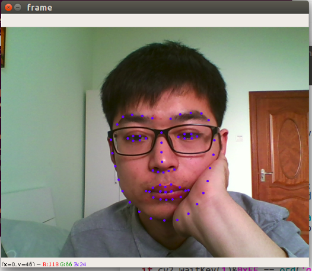

### 相关代码测试

依赖：opencv、pillow、opencv_contrib、dlib、TensorFace

#### 人脸检测

[Ubuntu16.04](../test/face_detection.py)  [RaspberryPi 4B](../test/face_detection_pi.py)

正脸识别：

侧脸识别：

#### 人脸特征提取

[Ubuntu16.04](../test/face_feature.py)  [RaspberryPi 4B](../test/face_feature_pi.py)

特征提取：

有遮挡：

